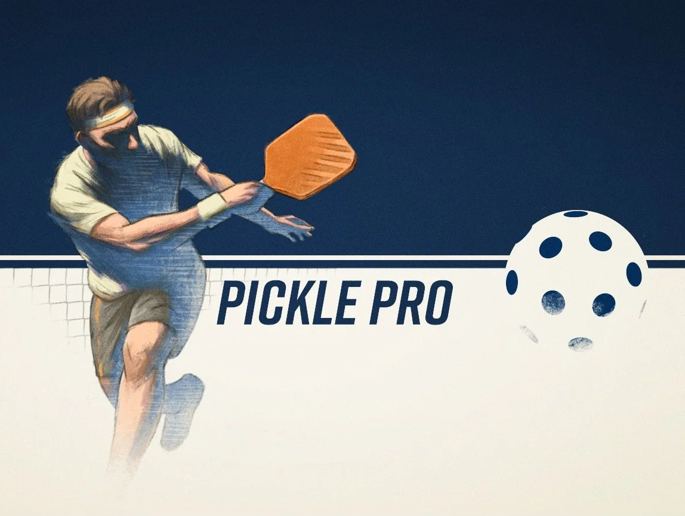
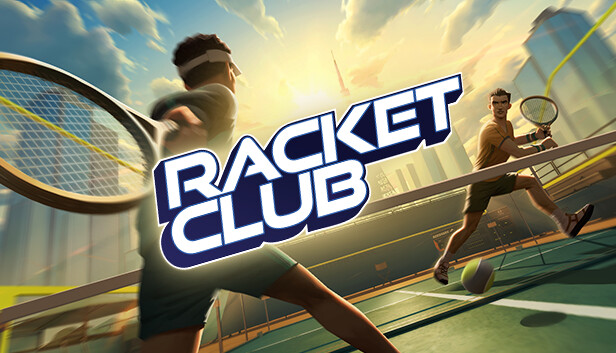
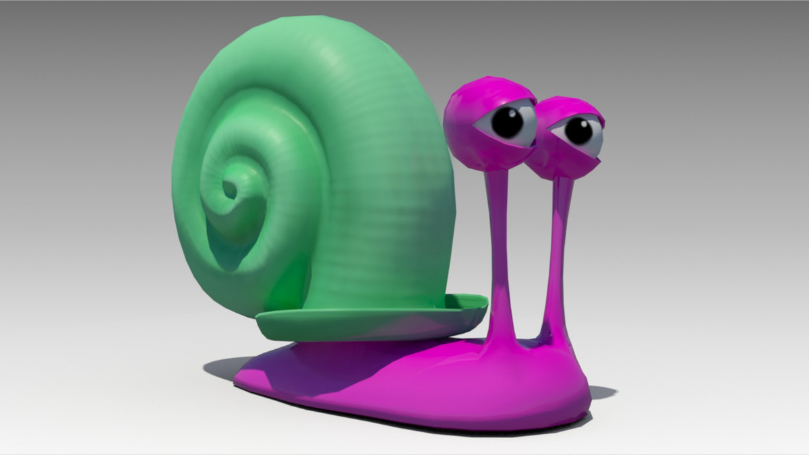

<!--  -->

## Professional Projects

### [Pickle Pro](https://www.resolutiongames.com/picklepro)

Pickleball Like You’ve Never Played Before!

Turn your surroundings into your personal pickleball court with Apple Vision Pro. With spatial controller support, every swing feels natural and precise, giving you the sensation of true racket control as you rally, score, and master the game.

---

### [Racket Club](https://www.resolutiongames.com/racketclub)

Step into a multi-sport game featuring four distinct racket sports!  Meet, compete and have fun together in a world where realistic racket sports physics meet a vibrant social scene to experience the spirit of your local racket club in VR.

---

### [Twenty Guys](https://www.resolutiongames.com/twentyguys)

So, you’ve got twenty guys...

🚶🏼‍➡️🚶🏽‍➡️🚶‍♀️‍➡️🚶🏾‍➡️🚶🏿‍➡️🚶🏻‍♀️‍➡️🚶‍♀️‍➡️🚶🏼‍♂️‍➡️🚶🏿‍♂️‍➡️🚶🏼‍➡️🚶🏽‍➡️🚶‍♀️‍➡️🚶🏽‍➡️🚶‍♀️‍➡️🚶🏼‍♂️‍➡️🚶🏿‍➡️🚶🏼‍♂️‍➡️🚶🏼‍➡️🚶🏽‍➡️🚶‍♀️‍➡️

Oh, and there are also fun tools, like a hammer, cheese-on-a-stick and a glue gun. What could possibly go wrong?

## Personal Projects

### What was that about?

Very short narrative VR game based on this [snail joke](https://www.reddit.com/r/Jokes/comments/gc8p1g/a_guy_throws_a_snail/).